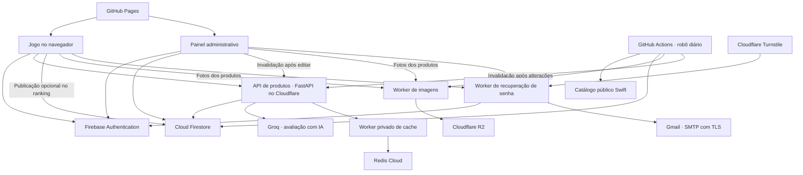

  

# Fechando Negócio — Missão EPAV

**Um jogo para praticar atendimento consultivo, escuta ativa e recomendação de produtos.**

O jogador assume o papel de um vendedor e atende cinco clientes com necessidades diferentes. Durante as conversas, precisa observar o contexto, fazer perguntas, interpretar as respostas e propor uma solução adequada. As decisões recebem feedback e ajudam a entender como um bom atendimento influencia a confiança e a satisfação do cliente.

O projeto reúne o jogo, um painel administrativo e serviços independentes para avaliar produtos com IA, sincronizar imagens e recuperar contas.

## Acesse

| Aplicação | Link |
| --- | --- |
| Jogo | **[Jogar Missão EPAV](https://epav-game.github.io/epav-game/)** |
| Painel administrativo | [Abrir EPAV Admin](https://epav-game.github.io/epav-admin/) |
| Documentação da API de produtos | [FastAPI / OpenAPI](https://epav-product-evaluator.kevinernandes2012.workers.dev/docs) |

O jogo permite iniciar a missão sem uma conta. A consulta e a avaliação de produtos exigem login. A publicação no ranking é opcional e depende da confirmação do jogador. O painel exige uma conta com permissão de administrador.

## O que o projeto oferece

### Experiência do jogador

- **Cinco atendimentos com diálogos ramificados:** clientes, objetivos e respostas diferentes, com feedback sobre as decisões.
- **Tutorial interativo e aba Ajuda:** introdução à dinâmica, orientações e dicas de atendimento.
- **Ficha de escuta:** reúne necessidades e informações descobertas durante a conversa.
- **Escolha contextual de produtos:** três opções sorteadas entre produtos que atendem aos tipos e à ocasião definidos para cada cliente, com foto, ficha e quantidade para comparar antes de recomendar. O sorteio não utiliza IA.
- **Avaliação com IA:** adequação do produto de **0 a 1000**, com justificativas, sugestões e informações que ainda precisam ser confirmadas. A pontuação dos diálogos possui sua própria escala, de até **400 pontos**.
- **Pausa e retomada:** progresso e histórico guardados no navegador, com controle do tempo da partida e do atendimento.
- **Carregamento prévio das imagens:** prepara os recursos visuais em segundo plano para facilitar as transições entre telas.
- **Ranking online:** ordenação por pontuação e, no desempate, pelo menor tempo de jogo.
- **Conta e recuperação de senha:** cadastro e login por e-mail, com recuperação integrada à identidade visual do projeto.

### Gestão do catálogo

O painel administrativo permite consultar produtos e suas fotos, buscar e filtrar o catálogo, editar nomes, disponibilidade, tipos e ocasiões de consumo, exportar JSON e consultar importações, resultados e histórico de alterações. Cada edição de produto gera um registro de auditoria por transação.

A base inicial veio de uma planilha com **3.695 registros**, convertida em JSON e importada no Firebase. O catálogo recebe tratamento de duplicados e associação de imagens; essa quantidade representa a importação original, pois a base ativa pode mudar.

### Automação das imagens

O robô consulta diariamente o catálogo público da Swift, usando códigos, nomes e características como marca, corte e peso para relacionar os alimentos. Prioriza os produtos do jogo sem foto, valida alterações com ETag/Last-Modified e comparação de pixels e reutiliza imagens iguais.

As fotos são convertidas para **WebP, 512 × 512 pixels e até 100 KiB**, armazenadas no Cloudflare R2 e vinculadas aos produtos no Firestore. Correspondências ambíguas ficam pendentes. A consolidação de duplicados e a remoção de itens ausentes têm verificações de integridade e preservam uma cópia recuperável no banco.

## Como a arquitetura se conecta

As consultas de produtos e ranking passam pela API. A seleção das três opções usa parâmetros pré-definidos dos clientes, filtra os campos públicos do catálogo e sorteia três alimentos distintos, sem IA; a avaliação utiliza a Groq para analisar a escolha à luz do contexto da conversa. Os Workers de imagens e recuperação executam seus próprios serviços.

### Cache compartilhado

O Redis reduz leituras repetidas do Firebase entre instâncias da API e jogadores. Consultas simultâneas da mesma chave usam um lock com expiração, e os dados têm validade automática:

| Conteúdo | Tempo de cache |
| --- | --- |
| Categorias e ocasiões dos produtos | 15 minutos |
| Ficha do produto usada na avaliação | 1 minuto |
| Top 20 do ranking público | 30 segundos |

Alterações do admin e do robô invalidam o cache do jogo, com propagação de até cinco segundos. Se o Redis ficar indisponível, a API consulta o Firebase. O painel também reutiliza o catálogo já carregado na memória da sessão por até cinco minutos; **Atualizar dados** busca novamente o servidor.

O cache precisa de uma leitura bem-sucedida para ser preenchido. Quando o Firebase esgota sua cota, a API aplica uma pausa curta compartilhada às novas consultas; isso evita repetir tentativas em massa durante o bloqueio.

## Tecnologias utilizadas

| Camada | Tecnologias | Aplicação no projeto |
| --- | --- | --- |
| Interfaces | **HTML5, CSS3 e JavaScript**, módulos ES | Jogo, tutorial, menus, comparação de produtos e painel administrativo |
| Recursos do navegador | DOM, Fetch API, LocalStorage, Web Audio API | Interações, chamadas aos serviços, progresso local e sons |
| Hospedagem dos sites | **GitHub Pages** | Publicação do jogo e do admin |
| Autenticação | **Firebase Authentication e Firebase Web SDK** | Contas, login, permissão administrativa e redefinição de senha |
| Banco de dados | **Cloud Firestore** | Produtos, ranking, auditoria, importações, sincronização e arquivos recuperáveis |
| Acesso dos serviços ao Firebase | APIs REST do Google, contas de serviço, OAuth 2.0 e JWT | Operações autorizadas dos serviços sem expor credenciais no navegador |
| API de produtos | **Python, FastAPI, Pydantic e Starlette** | Contratos da API, validação de dados e processamento do contexto |
| HTTP e desenvolvimento da API | HTTPX, Uvicorn e uv | Integrações externas, execução local e gerenciamento das dependências Python |
| Hospedagem dos serviços | **Cloudflare Workers e Python Workers** | APIs de produtos, imagens, recuperação e ponte privada para o Redis |
| Integração entre Workers | Service bindings, SDK de Python Workers, Pyodide/FFI e compatibilidade Node.js | Comunicação interna entre a API Python e o Worker de cache |
| Inteligência artificial | **Groq**, modelo padrão configurável `openai/gpt-oss-20b`, JSON Schema e OpenAPI | Avaliação estruturada, notas por critério e documentação da API |
| Cache | **Redis Cloud e cliente oficial Node Redis** | Cache compartilhado, validade automática, locks e invalidação |
| Armazenamento de imagens | **Cloudflare R2**, WebP e SHA-256 | Fotos otimizadas, identificação por conteúdo e arquivos iguais compartilhados |
| Robô de imagens | Python, Pillow, urllib, parser HTML, XML/sitemaps e JSON-LD | Consulta do catálogo Swift, correspondência dos alimentos e conversão das fotos |
| Proteção dos serviços | **Cloudflare Turnstile**, rate limits, CORS, Web Crypto, `cryptography` e HMAC | Verificação das solicitações, assinatura de tokens e controle de acesso |
| E-mail | **Gmail, SMTP com TLS, MIME e Cloudflare TCP sockets** | Envio dos links de recuperação de senha |
| Build e publicação | **Node.js, npm, Wrangler, Git e GitHub Actions** | Configuração dos sites, empacotamento dos Workers, testes, agendamento e deploy dos sites |
| Testes | **Python unittest, FastAPI TestClient e Node.js test runner** | Validação de cenários, autenticação, cache, respostas da IA, imagens e integrações |
| Documentação | **Markdown e Mermaid** | READMEs, conversas estruturadas e diagramas |

Na preparação da base, também foram usados **Excel/XLSX, JSON, scripts Python de ZIP/XML e Node.js com `@oai/artifact-tool`** para tratar e verificar a planilha. Essas ferramentas fazem parte do processo de importação dos dados.

O repositório do jogo conserva ainda uma **API opcional em Node.js, Express, SQLite3 e CORS** para persistência de tentativas. Ela faz parte do histórico técnico e pode ser executada separadamente. O fluxo publicado de catálogo e ranking utiliza o Firebase e os serviços apresentados no diagrama.

## Repositórios da organização

| Repositório | Responsabilidade |
| --- | --- |
| [epav-game](https://github.com/EPAV-GAME/epav-game) | Jogo, cenários, tutorial, ajuda, progresso, seleção de produtos e ranking |
| [epav-admin](https://github.com/EPAV-GAME/epav-admin) | Gestão do catálogo, fotos, auditoria, importações, resultados e recuperação de contas |
| [epav-product-evaluator](https://github.com/EPAV-GAME/epav-product-evaluator) | API FastAPI, recomendação contextual, avaliação Groq, ranking e Worker privado de cache Redis |
| [epav-swift-images](https://github.com/EPAV-GAME/epav-swift-images) | Robô diário, tratamento do catálogo, otimização das fotos e Worker de acesso ao R2 |
| [epav-password-reset](https://github.com/EPAV-GAME/epav-password-reset) | Serviço de recuperação com Firebase Authentication, Turnstile e Gmail |
| [.github](https://github.com/EPAV-GAME/.github) | Apresentação pública da organização e visão geral da arquitetura |

Cada repositório contém orientações de configuração e seus próprios comandos de execução ou publicação. GitHub Actions publica os sites e executa verificações; o robô de imagens também possui agendamento diário. Os Workers são publicados com Wrangler, conforme a configuração de cada serviço.

## Dados e acesso

As credenciais de serviço ficam nos segredos do Cloudflare e do GitHub Actions. O navegador recebe a configuração pública do Firebase e os dados necessários à interface. Regras do Firestore, tokens Firebase e a claim administrativa controlam o acesso.

A API de avaliação envia à Groq o contexto fictício do atendimento e campos selecionados do produto. O Redis guarda campos públicos do catálogo e do ranking. Margens, fornecedores, credenciais e identidade da conta do jogador são preservados fora dessas integrações.

As notas representam feedback pedagógico. O ranking atual recebe resultados calculados no navegador, com validação de formato e propriedade do registro; uma competição com premiação precisaria de validação das ações da partida no servidor.
